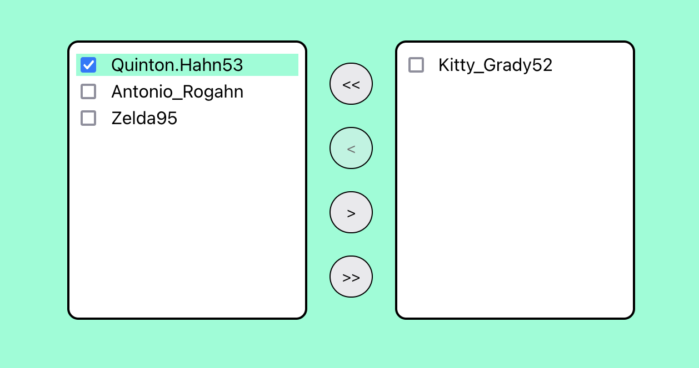

# Getting Started with Create React App

This project was bootstrapped with [Create React App](https://github.com/facebook/create-react-app).

## Available Scripts

### `npm start`

Runs the app in the development mode.\
Open [http://localhost:3000](http://localhost:3000) to view it in the browser.

### Create ‘Transfer List’ component.

#### Description

General component structure is: it should have 2 columns, with different items in each
and pagination with controls. Item in each column has text label + input(checkbox type) for selecting which item should be transferred to the opposite column. Items can be transferred for column 1 to column 2 and the opposite. Controls should have next buttons:

1) transfer selected items from column 1 to column 2;
2) transfer selected items from column 2 to column 1;
3) transfer all items from column 1 to column 2;
4) transfer all items from column 2 to column 1;

For the buttons ‘1)’ and ‘2)’, they should be active only when items in appropriate column is selected(e.g. if user selects items in column 1 - then button ‘1)’ should be active. If no items selected in column 1 - button ‘1)’ is disabled. Same goes for column 2 and button ‘2)’).

For the buttons ‘3)’ and ‘4)’. They are active only if items in appropriate column are present(e.g. If there are no items in column 1 - button ‘3)’ is disabled. Same goes for button ‘4)’).

Images for better understanding of what should be done:
https://prnt.sc/vltUMFVRPWfM - default view
https://prnt.sc/RnRxvaDaBGRv - view when items in column 1 are selected and button ‘1)’ is active
https://prnt.sc/mY0YuqaB9OuK - view when items in column 2 are selected and button ‘2)’ is active
https://prnt.sc/nnz7QmSZ7ITx - view when items in column 2 are absent, so button ‘4)’ is disabled

Acceptance criteria:
1) All functionality from the description above is done
2) Use React hooks for internal component state(useState)
3) Use Functional component type
4) Ideally implement it using ‘React create app’ or any other way you prefer
5) Would be nice to add some ‘handy’ and ‘nice’ styling using SASS/SCSS

